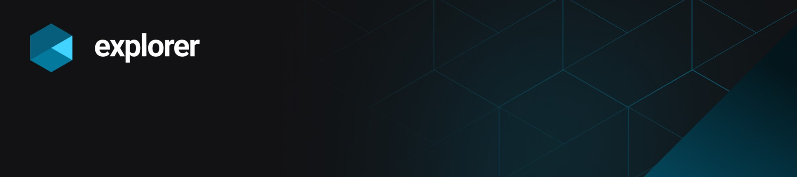
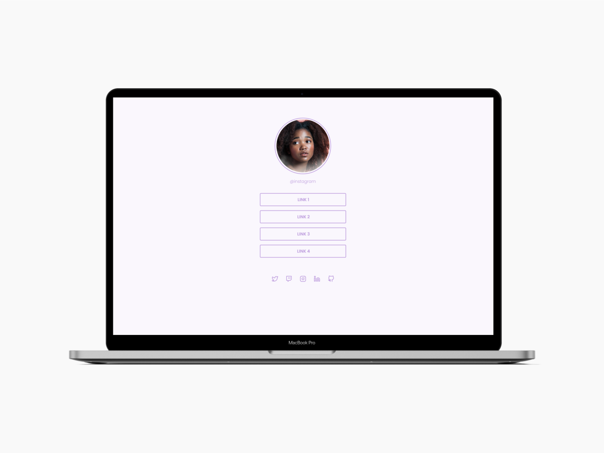

<h1 align="center">
    
    
Repositóriso com desafios extras do curso explorer ministrado pela Rocketseat

</h1>

## 💻 Desafio Profile
 Criação uma página, a partir de layout no Figma, com uma lista de links que pode ser usada em perfis de redes sociais.

 ## 🚀 Techs

    
        

  
O site pode ser visualizado no link abaixo: 
<a href="https://devaugustow.github.io/rocketseat_desafios/links-para-rede-social/index.html">https://devaugustow.github.io/rocketseat_desafios/links-para-rede-social/index.html</a>  

    

  

 

## 💻 Desafio Portfolio
Este desafio propõe a criação de um portifolio com o intuito de reforçar conceitos de posicionamento de elementos na tela. 

 ## 🚀 Techs

    
        

  
O site pode ser visualizado no link abaixo: 
<a href="https://devaugustow.github.io/rocketseat_desafios/portfoli/index.html">https://devaugustow.github.io/rocketseat_desafios/portfolio/index.html</a>  

    

  

